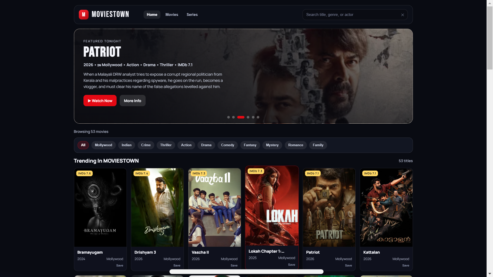

# 🎬 MOVIESTOWN

A modern Netflix-inspired movie and TV series discovery platform powered by the TMDB API. Explore trending movies, popular TV shows, and regional content through a beautiful, responsive, and user-friendly interface.

---

## ✨ Features

### 🔍 Smart Search & Discovery

* Search movies and TV series worldwide
* Fast and responsive search experience
* Genre-based content filtering
* Trending and featured content sections

### 🇮🇳 Regional Content Focus

* Prioritized discovery for Indian cinema
* Enhanced support for Malayalam (Mollywood) content
* Regional content badges and categorization

### 🎥 Detailed Content Information

* High-quality posters and ratings
* Movie and TV series overview
* Director and cast information
* Runtime, release date, and country details
* Quick trailer access

### ❤️ User Experience

* Save favorites using Local Storage
* Persistent Dark/Light Theme
* Smooth animations and transitions
* Fully responsive design for all devices

---

## 🛠️ Tech Stack

* HTML5
* CSS3
* JavaScript (ES6+)
* TMDB API
* LocalStorage

---

## 📁 Project Structure

```text
moviestown/
├── index.html
├── style.css
├── script.js
└── README.md
```

---

## 🚀 Getting Started

### Clone Repository

```bash
git clone https://github.com/alphonsbiju7/moviestown.git
cd moviestown
```

### Run Locally

Simply open:

```text
index.html
```

in your browser.

Alternatively, use a local server:

```bash
python -m http.server 8000
```

---

## 🌐 Live Demo

https://movies-town-app.vercel.app/

Example:

```text
https://moviestown.vercel.app
```

---

## 📸 Preview

<p align="center">
  
</p>

---

## 🔑 API

This project uses the TMDB API for movie and TV series information.

To use your own API key:

1. Create an account on TMDB
2. Generate an API key
3. Replace the API key in `script.js`

---

## 👨‍💻 Author

**Alphons Biju**

* B.Tech Computer Science & Engineering
* Frontend Developer
* UI/UX Designer
* Tech Content Creator


---

## 🙏 Acknowledgements

* TMDB API
* Font Awesome
* Google Fonts
* Vercel

---

## 📄 License

This project is developed for educational, learning, and portfolio purposes.

---

<div align="center">

Made with ❤️ by Alphons Biju

</div>
